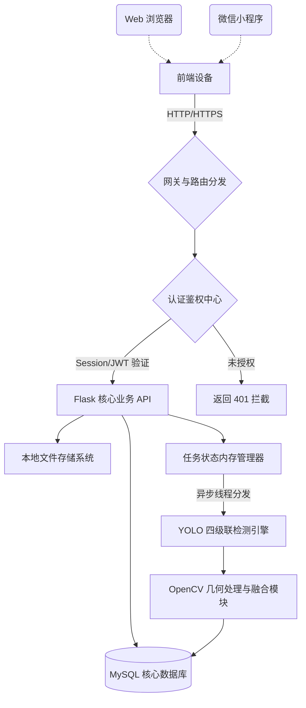
```mermaid
graph TD
    A[前端设备] -->|HTTP/HTTPS| B{网关与路由分发}
    A1(Web 浏览器) -.-> A
    A2(微信小程序) -.-> A
    B --> C{认证鉴权中心}
    C -->|Session/JWT 验证| D[Flask 核心业务 API]
    C -->|未授权| X[返回 401 拦截]
    D --> E[本地文件存储系统]
    D --> F[(MySQL 核心数据库)]
    D --> G[任务状态内存管理器]
    G -->|异步线程分发| H[YOLO 四级联检测引擎]
    H --> I[OpenCV 几何处理与融合模块]
    I --> F
```

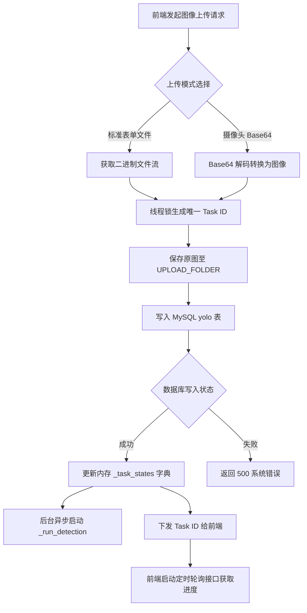
```mermaid
graph TD
    A[前端发起图像上传请求] --> B{上传模式选择}
    B -->|标准表单文件| C[获取二进制文件流]
    B -->|摄像头 Base64| D[Base64 解码转换为图像]
    C --> E[线程锁生成唯一 Task ID]
    D --> E
    E --> F[保存原图至 UPLOAD_FOLDER]
    F --> G[写入 MySQL yolo 表]
    G --> H{数据库写入状态}
    H -->|成功| I[更新内存 _task_states 字典]
    H -->|失败| J[返回 500 系统错误]
    I --> K[后台异步启动 _run_detection]
    I --> L[下发 Task ID 给前端]
    L --> M[前端启动定时轮询接口获取进度]
```

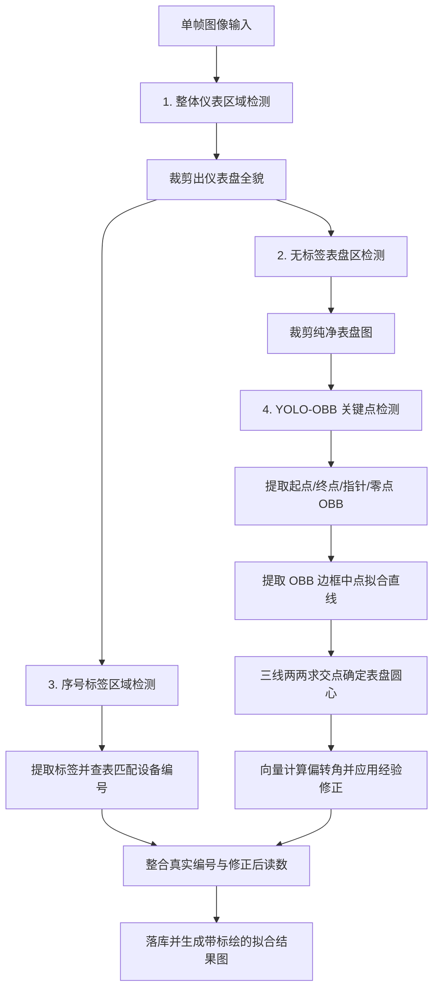
```mermaid
graph TD
    A[单帧图像输入] --> B[1. 整体仪表区域检测]
    B --> C[裁剪出仪表盘全貌]
    C --> D[2. 无标签表盘区检测]
    C --> E[3. 序号标签区域检测]
    E --> F[提取标签并查表匹配设备编号]
    D --> G[裁剪纯净表盘图]
    G --> H[4. YOLO-OBB 关键点检测]
    H --> I[提取起点/终点/指针/零点 OBB]
    I --> J[提取 OBB 边框中点拟合直线]
    J --> K[三线两两求交点确定表盘圆心]
    K --> L[向量计算偏转角并应用经验修正]
    F --> M[整合真实编号与修正后读数]
    L --> M
    M --> N[落库并生成带标绘的拟合结果图]
```

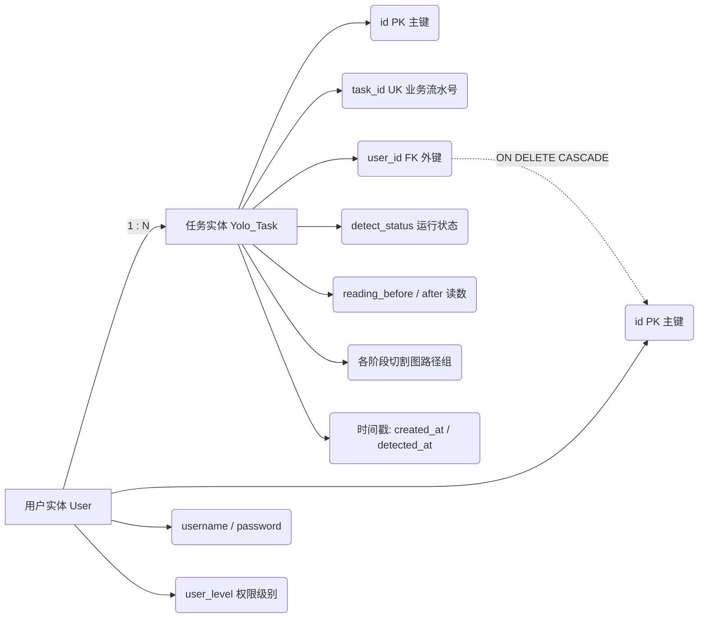
```mermaid
graph LR
    U[用户实体 User] -->|1 : N| T[任务实体 Yolo_Task]
    U --> U1(id PK 主键)
    U --> U2(username / password)
    U --> U3(user_level 权限级别)
    T --> T1(id PK 主键)
    T --> T2(task_id UK 业务流水号)
    T --> T3(user_id FK 外键)
    T --> T4(detect_status 运行状态)
    T --> T5(reading_before / after 读数)
    T --> T6(各阶段切割图路径组)
    T --> T7(时间戳: created_at / detected_at)
    T3 -.->|ON DELETE CASCADE| U1
```

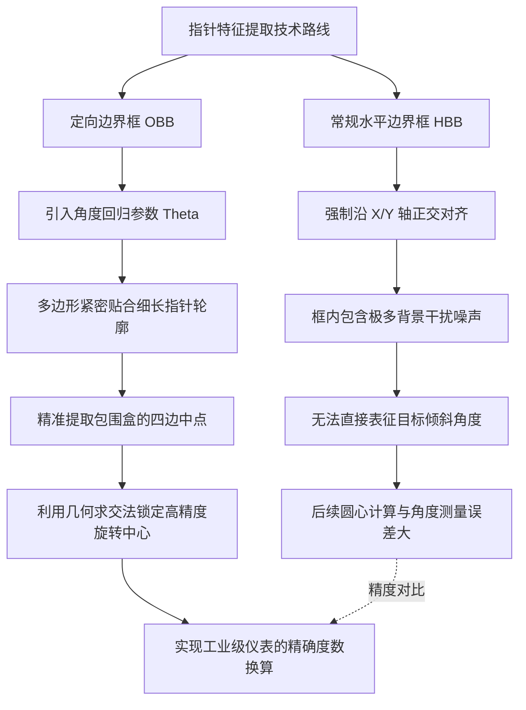
```mermaid
graph TD
    A[指针特征提取技术路线] --> B[常规水平边界框 HBB]
    A --> C[定向边界框 OBB]
    B --> D[强制沿 X/Y 轴正交对齐]
    D --> E[框内包含极多背景干扰噪声]
    E --> F[无法直接表征目标倾斜角度]
    F --> G[后续圆心计算与角度测量误差大]
    C --> H[引入角度回归参数 Theta]
    H --> I[多边形紧密贴合细长指针轮廓]
    I --> J[精准提取包围盒的四边中点]
    J --> K[利用几何求交法锁定高精度旋转中心]
    K --> L[实现工业级仪表的精确度数换算]
    G -.->|精度对比| L
```

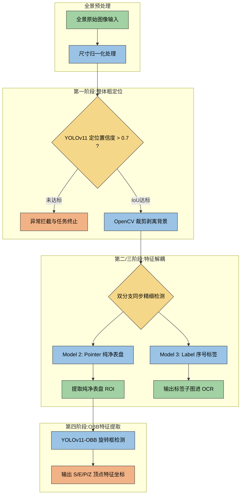
```mermaid
graph TD
    classDef green fill:#a2d1a3,stroke:#333,stroke-width:1px,color:#000;
    classDef blue fill:#9ac3e5,stroke:#333,stroke-width:1px,color:#000;
    classDef yellow fill:#f5d78a,stroke:#333,stroke-width:1px,color:#000;
    classDef orange fill:#f1b286,stroke:#333,stroke-width:1px,color:#000;

    subgraph 全景预处理
        A[全景原始图像输入]:::green --> B[尺寸归一化处理]:::blue
    end

    subgraph 第一阶段:整体粗定位
        B --> C{YOLOv11 定位置信度 > 0.7 ?}:::yellow
        C -->|未达标| D[异常拦截与任务终止]:::orange
        C -->|IoU达标| E[OpenCV 裁剪剥离背景]:::blue
    end

    subgraph 第二/三阶段:特征解耦
        E --> F{双分支同步精细检测}:::yellow
        F --> G[Model 2: Pointer 纯净表盘]:::blue
        F --> H[Model 3: Label 序号标签]:::blue
        G --> I[提取纯净表盘 ROI]:::green
        H --> J[输出标签子图进 OCR]:::green
    end

    subgraph 第四阶段:OBB特征提取
        I --> K[YOLOv11-OBB 旋转框检测]:::blue
        K --> L[输出 S/E/P/Z 顶点特征坐标]:::orange
    end
```

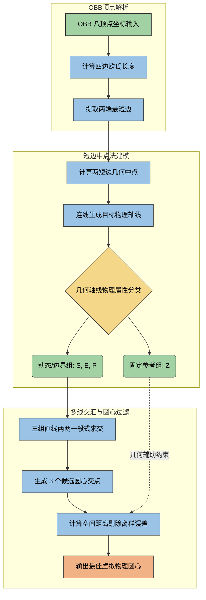
```mermaid
graph TD
    classDef green fill:#a2d1a3,stroke:#333,stroke-width:1px,color:#000;
    classDef blue fill:#9ac3e5,stroke:#333,stroke-width:1px,color:#000;
    classDef yellow fill:#f5d78a,stroke:#333,stroke-width:1px,color:#000;
    classDef orange fill:#f1b286,stroke:#333,stroke-width:1px,color:#000;

    subgraph OBB顶点解析
        A[OBB 八顶点坐标输入]:::green --> B[计算四边欧氏长度]:::blue
        B --> C[提取两端最短边]:::blue
    end

    subgraph 短边中点法建模
        C --> D[计算两短边几何中点]:::blue
        D --> E[连线生成目标物理轴线]:::blue
        E --> F{几何轴线物理属性分类}:::yellow
        F --> G(动态/边界组: S, E, P):::green
        F --> H(固定参考组: Z):::green
    end

    subgraph 多线交汇与圆心过滤
        G --> I[三组直线两两一般式求交]:::blue
        I --> J[生成 3 个候选圆心交点]:::blue
        J --> K[计算空间距离剔除离群误差]:::blue
        H -.->|几何辅助约束| K
        K --> L[输出最佳虚拟物理圆心]:::orange
    end
```

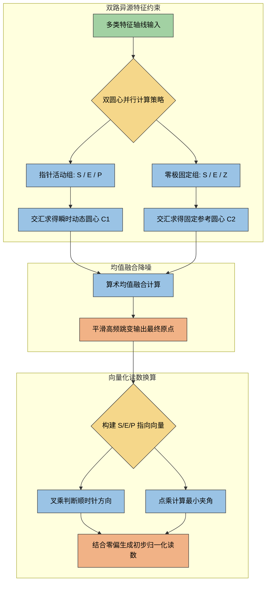
```mermaid
graph TD
    classDef green fill:#a2d1a3,stroke:#333,stroke-width:1px,color:#000;
    classDef blue fill:#9ac3e5,stroke:#333,stroke-width:1px,color:#000;
    classDef yellow fill:#f5d78a,stroke:#333,stroke-width:1px,color:#000;
    classDef orange fill:#f1b286,stroke:#333,stroke-width:1px,color:#000;

    subgraph 双路异源特征约束
        A[多类特征轴线输入]:::green --> B{双圆心并行计算策略}:::yellow
        B --> C[指针活动组: S / E / P]:::blue
        B --> D[零极固定组: S / E / Z]:::blue
        C --> E[交汇求得瞬时动态圆心 C1]:::blue
        D --> F[交汇求得固定参考圆心 C2]:::blue
    end

    subgraph 均值融合降噪
        E --> G[算术均值融合计算]:::blue
        F --> G
        G --> H[平滑高频跳变输出最终原点]:::orange
    end

    subgraph 向量化读数换算
        H --> I{构建 S/E/P 指向向量}:::yellow
        I --> J[叉乘判断顺时针方向]:::blue
        I --> K[点乘计算最小夹角]:::blue
        J --> L[结合零偏生成初步归一化读数]:::orange
        K --> L
    end
```

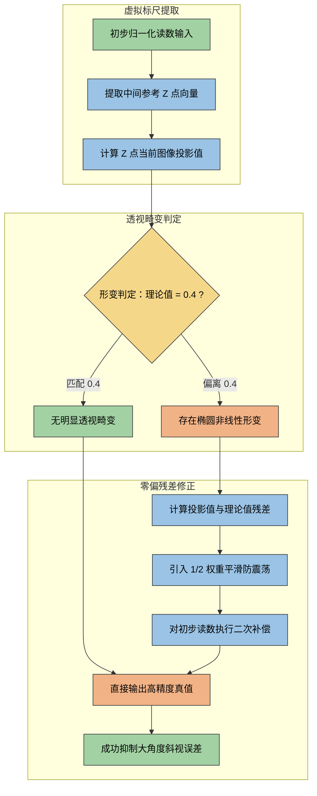
```mermaid
graph TD
    classDef green fill:#a2d1a3,stroke:#333,stroke-width:1px,color:#000;
    classDef blue fill:#9ac3e5,stroke:#333,stroke-width:1px,color:#000;
    classDef yellow fill:#f5d78a,stroke:#333,stroke-width:1px,color:#000;
    classDef orange fill:#f1b286,stroke:#333,stroke-width:1px,color:#000;

    subgraph 虚拟标尺提取
        A[初步归一化读数输入]:::green --> B[提取中间参考 Z 点向量]:::blue
        B --> C[计算 Z 点当前图像投影值]:::blue
    end

    subgraph 透视畸变判定
        C --> D{形变判定：理论值 = 0.4 ?}:::yellow
        D -->|匹配 0.4| E[无明显透视畸变]:::green
        D -->|偏离 0.4| F[存在椭圆非线性形变]:::orange
    end

    subgraph 零偏残差修正
        F --> G[计算投影值与理论值残差]:::blue
        G --> H[引入 1/2 权重平滑防震荡]:::blue
        H --> I[对初步读数执行二次补偿]:::blue
        E --> J[直接输出高精度真值]:::orange
        I --> J
        J --> K[成功抑制大角度斜视误差]:::green
    end

```

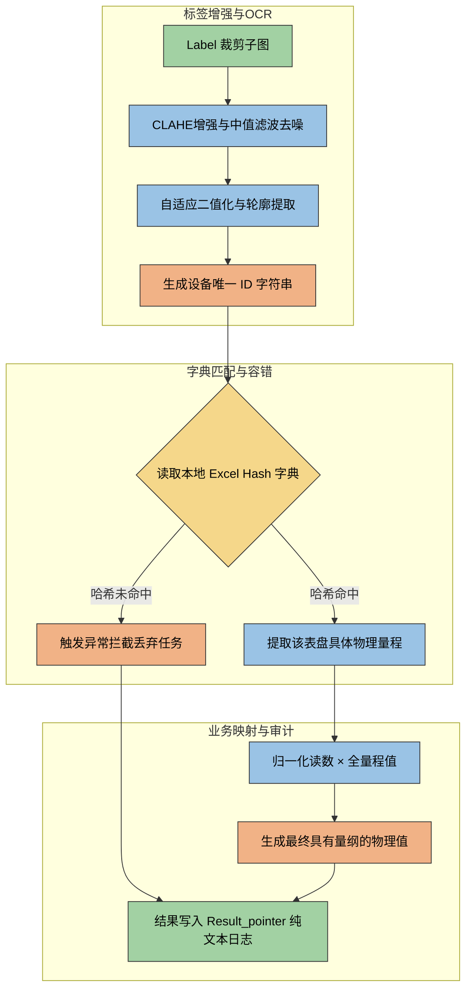
```mermaid
graph TD
    classDef green fill:#a2d1a3,stroke:#333,stroke-width:1px,color:#000;
    classDef blue fill:#9ac3e5,stroke:#333,stroke-width:1px,color:#000;
    classDef yellow fill:#f5d78a,stroke:#333,stroke-width:1px,color:#000;
    classDef orange fill:#f1b286,stroke:#333,stroke-width:1px,color:#000;

    subgraph 标签增强与OCR
        A[Label 裁剪子图]:::green --> B[CLAHE增强与中值滤波去噪]:::blue
        B --> C[自适应二值化与轮廓提取]:::blue
        C --> D[生成设备唯一 ID 字符串]:::orange
    end

    subgraph 字典匹配与容错
        D --> E{读取本地 Excel Hash 字典}:::yellow
        E -->|哈希未命中| F[触发异常拦截丢弃任务]:::orange
        E -->|哈希命中| G[提取该表盘具体物理量程]:::blue
    end

    subgraph 业务映射与审计
        G --> H[归一化读数 × 全量程值]:::blue
        H --> I[生成最终具有量纲的物理值]:::orange
        F --> J[结果写入 Result_pointer 纯文本日志]:::green
        I --> J
    end

```

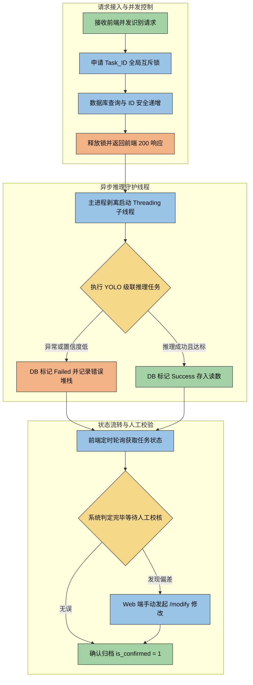
```mermaid
graph TD
    classDef green fill:#a2d1a3,stroke:#333,stroke-width:1px,color:#000;
    classDef blue fill:#9ac3e5,stroke:#333,stroke-width:1px,color:#000;
    classDef yellow fill:#f5d78a,stroke:#333,stroke-width:1px,color:#000;
    classDef orange fill:#f1b286,stroke:#333,stroke-width:1px,color:#000;

    subgraph 请求接入与并发控制
        A[接收前端并发识别请求]:::green --> B[申请 Task_ID 全局互斥锁]:::blue
        B --> C[数据库查询与 ID 安全递增]:::blue
        C --> D[释放锁并返回前端 200 响应]:::orange
    end

    subgraph 异步推理守护线程
        D --> E[主进程剥离启动 Threading 子线程]:::blue
        E --> F{执行 YOLO 级联推理任务}:::yellow
        F -->|异常或置信度低| G[DB 标记 Failed 并记录错误堆栈]:::orange
        F -->|推理成功且达标| H[DB 标记 Success 存入读数]:::green
    end

    subgraph 状态流转与人工校验
        G --> I[前端定时轮询获取任务状态]:::blue
        H --> I
        I --> J{系统判定完毕等待人工校核}:::yellow
        J -->|发现偏差| K[Web 端手动发起 /modify 修改]:::blue
        J -->|无误| L[确认归档 is_confirmed = 1]:::green
        K --> L
    end
```

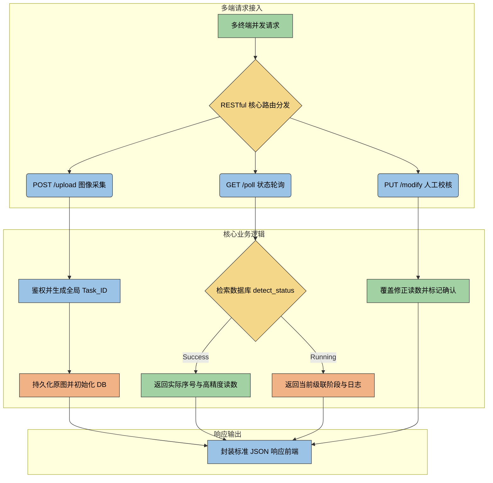
```mermaid
graph TD
    classDef green fill:#a2d1a3,stroke:#333,stroke-width:1px,color:#000;
    classDef blue fill:#9ac3e5,stroke:#333,stroke-width:1px,color:#000;
    classDef yellow fill:#f5d78a,stroke:#333,stroke-width:1px,color:#000;
    classDef orange fill:#f1b286,stroke:#333,stroke-width:1px,color:#000;

    subgraph 多端请求接入
        A[多终端并发请求]:::green --> B{RESTful 核心路由分发}:::yellow
        B --> C(POST /upload 图像采集):::blue
        B --> D(GET /poll 状态轮询):::blue
        B --> E(PUT /modify 人工校核):::blue
    end

    subgraph 核心业务逻辑
        C --> F[鉴权并生成全局 Task_ID]:::blue
        F --> G[持久化原图并初始化 DB]:::orange
        D --> H{检索数据库 detect_status}:::yellow
        H -->|Success| I[返回实际序号与高精度读数]:::green
        H -->|Running| J[返回当前级联阶段与日志]:::orange
        E --> K[覆盖修正读数并标记确认]:::green
    end

    subgraph 响应输出
        G --> L[封装标准 JSON 响应前端]:::blue
        I --> L
        J --> L
        K --> L
    end
```

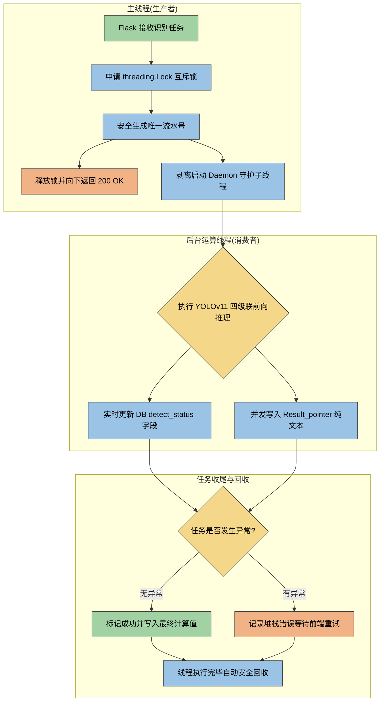
```mermaid
graph TD
    classDef green fill:#a2d1a3,stroke:#333,stroke-width:1px,color:#000;
    classDef blue fill:#9ac3e5,stroke:#333,stroke-width:1px,color:#000;
    classDef yellow fill:#f5d78a,stroke:#333,stroke-width:1px,color:#000;
    classDef orange fill:#f1b286,stroke:#333,stroke-width:1px,color:#000;

    subgraph "主线程(生产者)"
        A[Flask 接收识别任务]:::green --> B[申请 threading.Lock 互斥锁]:::blue
        B --> C[安全生成唯一流水号]:::blue
        C --> D[释放锁并向下返回 200 OK]:::orange
        C --> E[剥离启动 Daemon 守护子线程]:::blue
    end

    subgraph "后台运算线程(消费者)"
        E --> F{执行 YOLOv11 四级联前向推理}:::yellow
        F --> G[实时更新 DB detect_status 字段]:::blue
        F --> H[并发写入 Result_pointer 纯文本]:::blue
    end

    subgraph 任务收尾与回收
        G --> I{任务是否发生异常?}:::yellow
        H --> I
        I -->|无异常| J[标记成功并写入最终计算值]:::green
        I -->|有异常| K[记录堆栈错误等待前端重试]:::orange
        J --> L[线程执行完毕自动安全回收]:::blue
        K --> L
    end
```

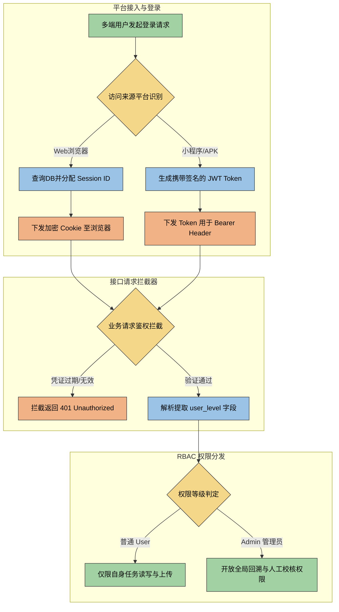
```mermaid
graph TD
    classDef green fill:#a2d1a3,stroke:#333,stroke-width:1px,color:#000;
    classDef blue fill:#9ac3e5,stroke:#333,stroke-width:1px,color:#000;
    classDef yellow fill:#f5d78a,stroke:#333,stroke-width:1px,color:#000;
    classDef orange fill:#f1b286,stroke:#333,stroke-width:1px,color:#000;

    subgraph 平台接入与登录
        A[多端用户发起登录请求]:::green --> B{访问来源平台识别}:::yellow
        B -->|Web浏览器| C[查询DB并分配 Session ID]:::blue
        B -->|小程序/APK| D[生成携带签名的 JWT Token]:::blue
        C --> E[下发加密 Cookie 至浏览器]:::orange
        D --> F[下发 Token 用于 Bearer Header]:::orange
    end

    subgraph 接口请求拦截器
        E --> G{业务请求鉴权拦截}:::yellow
        F --> G
        G -->|凭证过期/无效| H[拦截返回 401 Unauthorized]:::orange
        G -->|验证通过| I[解析提取 user_level 字段]:::blue
    end

    subgraph RBAC 权限分发
        I --> J{权限等级判定}:::yellow
        J -->|普通 User| K[仅限自身任务读写与上传]:::green
        J -->|Admin 管理员| L[开放全局回溯与人工校核权限]:::green
    end
```

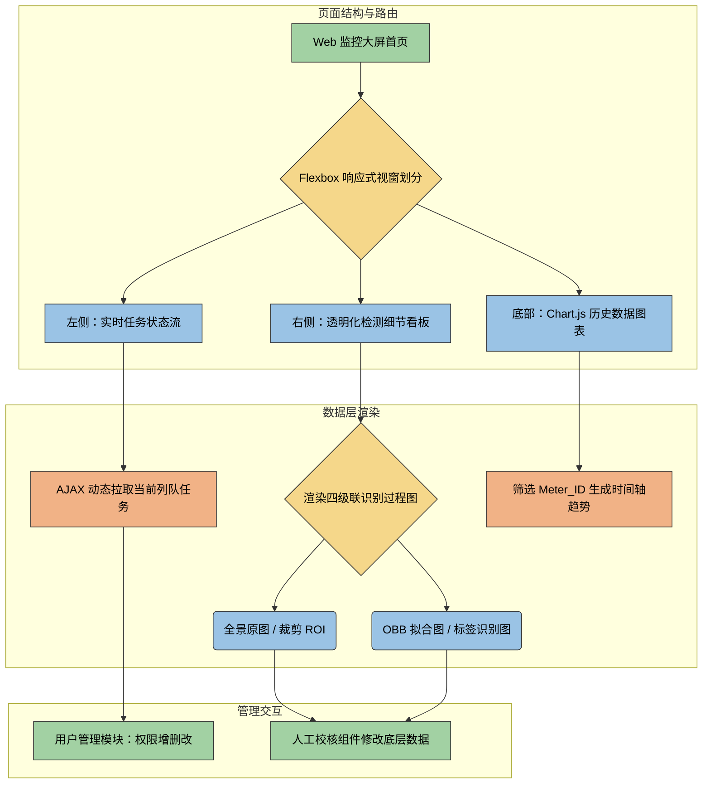
```mermaid
graph TD
    classDef green fill:#a2d1a3,stroke:#333,stroke-width:1px,color:#000;
    classDef blue fill:#9ac3e5,stroke:#333,stroke-width:1px,color:#000;
    classDef yellow fill:#f5d78a,stroke:#333,stroke-width:1px,color:#000;
    classDef orange fill:#f1b286,stroke:#333,stroke-width:1px,color:#000;

    subgraph 页面结构与路由
        A[Web 监控大屏首页]:::green --> B{Flexbox 响应式视窗划分}:::yellow
        B --> C[左侧：实时任务状态流]:::blue
        B --> D[右侧：透明化检测细节看板]:::blue
        B --> E[底部：Chart.js 历史数据图表]:::blue
    end

    subgraph 数据层渲染
        C --> F[AJAX 动态拉取当前列队任务]:::orange
        D --> G{渲染四级联识别过程图}:::yellow
        G --> H(全景原图 / 裁剪 ROI):::blue
        G --> I(OBB 拟合图 / 标签识别图):::blue
        E --> J[筛选 Meter_ID 生成时间轴趋势]:::orange
    end

    subgraph 管理交互
        F --> K[用户管理模块：权限增删改]:::green
        H --> L[人工校核组件修改底层数据]:::green
        I --> L
    end
```

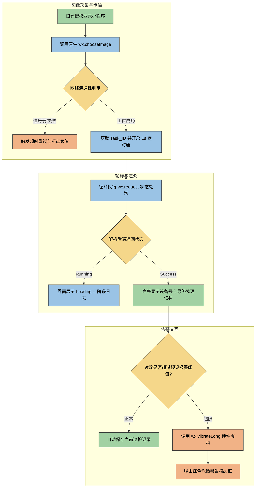
```mermaid
graph TD
    classDef green fill:#a2d1a3,stroke:#333,stroke-width:1px,color:#000;
    classDef blue fill:#9ac3e5,stroke:#333,stroke-width:1px,color:#000;
    classDef yellow fill:#f5d78a,stroke:#333,stroke-width:1px,color:#000;
    classDef orange fill:#f1b286,stroke:#333,stroke-width:1px,color:#000;

    subgraph 图像采集与传输
        A[扫码授权登录小程序]:::green --> B[调用原生 wx.chooseImage]:::blue
        B --> C{网络连通性判定}:::yellow
        C -->|信号弱/失败| D[触发超时重试与断点续传]:::orange
        C -->|上传成功| E[获取 Task_ID 并开启 1s 定时器]:::blue
    end

    subgraph 轮询与渲染
        E --> F[循环执行 wx.request 状态轮询]:::blue
        F --> G{解析后端返回状态}:::yellow
        G -->|Running| H[界面展示 Loading 与阶段日志]:::blue
        G -->|Success| I[高亮显示设备号与最终物理读数]:::green
    end

    subgraph 告警交互
        I --> J{读数是否超过预设报警阈值?}:::yellow
        J -->|正常| K[自动保存当前巡检记录]:::green
        J -->|超限| L[调用 wx.vibrateLong 硬件震动]:::orange
        L --> M[弹出红色危险警告模态框]:::orange
    end
```

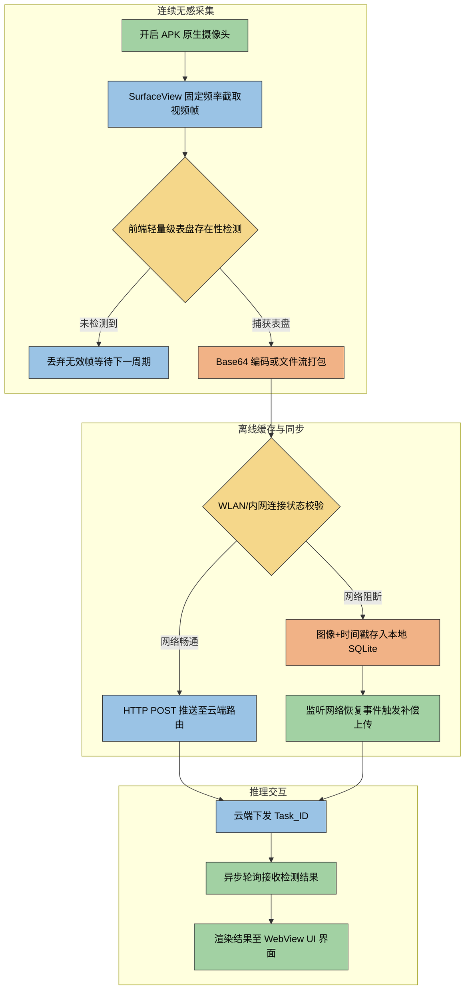
```mermaid
graph TD
    classDef green fill:#a2d1a3,stroke:#333,stroke-width:1px,color:#000;
    classDef blue fill:#9ac3e5,stroke:#333,stroke-width:1px,color:#000;
    classDef yellow fill:#f5d78a,stroke:#333,stroke-width:1px,color:#000;
    classDef orange fill:#f1b286,stroke:#333,stroke-width:1px,color:#000;

    subgraph 连续无感采集
        A[开启 APK 原生摄像头]:::green --> B[SurfaceView 固定频率截取视频帧]:::blue
        B --> C{前端轻量级表盘存在性检测}:::yellow
        C -->|未检测到| D[丢弃无效帧等待下一周期]:::blue
        C -->|捕获表盘| E[Base64 编码或文件流打包]:::orange
    end

    subgraph 离线缓存与同步
        E --> F{WLAN/内网连接状态校验}:::yellow
        F -->|网络阻断| G[图像+时间戳存入本地 SQLite]:::orange
        F -->|网络畅通| H[HTTP POST 推送至云端路由]:::blue
        G --> I[监听网络恢复事件触发补偿上传]:::green
    end

    subgraph 推理交互
        H --> J[云端下发 Task_ID]:::blue
        I --> J
        J --> K[异步轮询接收检测结果]:::green
        K --> L[渲染结果至 WebView UI 界面]:::green
    end
```
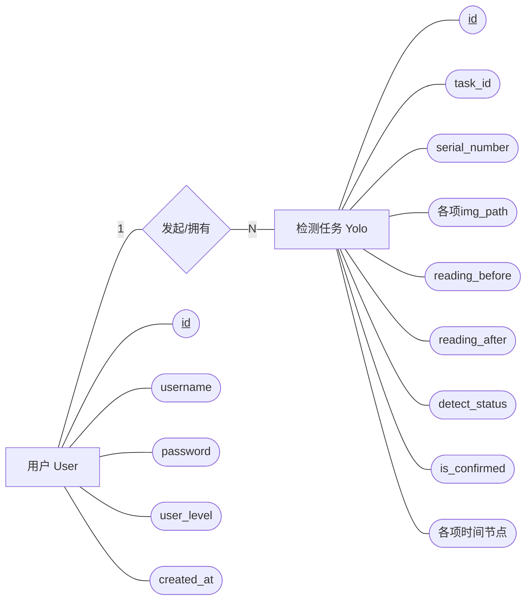
```mermaid
graph LR
    %% 实体
    E_User[用户 User]
    E_Yolo[检测任务 Yolo]

    %% 联系
    R_Owns{发起/拥有}

    %% 实体与联系的连线 (标明 1:N 基数)
    E_User ---|1| R_Owns
    R_Owns ---|N| E_Yolo

    %% 用户属性
    U_id([<u>id</u>])
    U_name([username])
    U_pwd([password])
    U_level([user_level])
    U_create([created_at])

    E_User --- U_id
    E_User --- U_name
    E_User --- U_pwd
    E_User --- U_level
    E_User --- U_create

    %% 任务属性 (部分过长的路径合并展示以保证图表美观)
    Y_id([<u>id</u>])
    Y_tid([task_id])
    Y_sn([serial_number])
    Y_imgs([各项img_path])
    Y_rb([reading_before])
    Y_ra([reading_after])
    Y_stat([detect_status])
    Y_conf([is_confirmed])
    Y_time([各项时间节点])

    E_Yolo --- Y_id
    E_Yolo --- Y_tid
    E_Yolo --- Y_sn
    E_Yolo --- Y_imgs
    E_Yolo --- Y_rb
    E_Yolo --- Y_ra
    E_Yolo --- Y_stat
    E_Yolo --- Y_conf
    E_Yolo --- Y_time
```
```mermaid
graph TD
    L1[直线 S] --> I1(交点 ise2)
    L2[直线 E] --> I1
    L1 --> I2(交点 isp)
    L3[直线 P] --> I2
    L2 --> I3(交点 iep)
    L3 --> I3
    
    I1 & I2 & I3 --> Dist[计算距离: d1, d2, d3]
    Dist --> Min[寻找最小距离(如 d_ise2_isp)]
    Min --> CXCY[计算最终估算圆心 (cx, cy)]
    
    style Min fill:#fee2e2,stroke:#dc2626
    style CXCY fill:#e0f2fe,stroke:#0284c7,stroke-width:2px
```
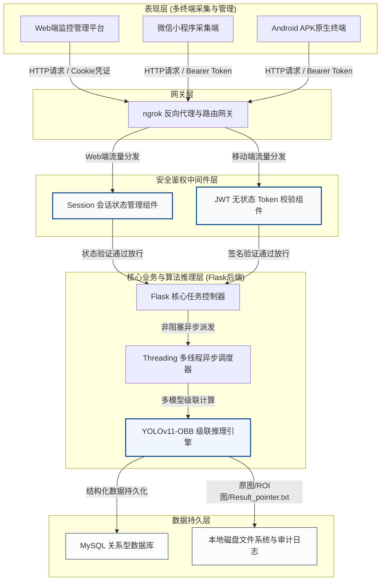
```mermaid
graph TD
    %% 表现层 (3个节点)
    subgraph L1["表现层 (多终端采集与管理)"]
        A1[Web端监控管理平台]
        A2[微信小程序采集端]
        A3[Android APK原生终端]
    end

    %% 网关层 (1个节点)
    subgraph 网关层
        B[ngrok 反向代理与路由网关]
    end

    %% 安全鉴权中间件层 (2个节点)
    subgraph 安全鉴权中间件层
        C1[Session 会话状态管理组件]
        C2[JWT 无状态 Token 校验组件]
    end

    %% 核心业务与算法推理层 (3个节点)
    subgraph L2["核心业务与算法推理层 (Flask后端)"]
        D1[Flask 核心任务控制器]
        D2[Threading 多线程异步调度器]
        D3[YOLOv11-OBB 级联推理引擎]
    end

    %% 数据持久层 (2个节点)
    subgraph 数据持久层
        E1[MySQL 关系型数据库]
        E2[本地磁盘文件系统与审计日志]
    end

    %% 数据流向连线 (节点总数：3 + 1 + 2 + 3 + 2 = 11个)
    A1 -->|HTTP请求 / Cookie凭证| B
    A2 -->|HTTP请求 / Bearer Token| B
    A3 -->|HTTP请求 / Bearer Token| B
    
    B -->|Web端流量分发| C1
    B -->|移动端流量分发| C2
    
    C1 -->|状态验证通过放行| D1
    C2 -->|签名验证通过放行| D1
    
    D1 -->|非阻塞异步派发| D2
    D2 -->|多模型级联计算| D3
    
    D3 -->|结构化数据持久化| E1
    D3 -->|原图/ROI图/Result_pointer.txt| E2

    %% 节点样式美化
    style C1 fill:#f8fafc,stroke:#004098,stroke-width:2px;
    style C2 fill:#f8fafc,stroke:#004098,stroke-width:2px;
    style D3 fill:#eff6ff,stroke:#004098,stroke-width:2px;
    style E1 fill:#fcfcfc,stroke:#334155,stroke-width:1px;
    style E2 fill:#fcfcfc,stroke:#334155,stroke-width:1px;
```