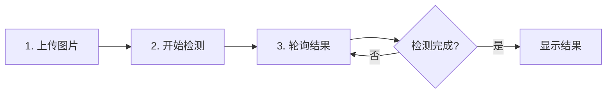

# 仪态万象系统 - 微信小程序

<div align="center">


**基于 YOLOv11 深度学习模型的智能指针式仪表读数识别系统**

[功能特性](#功能特性) • [快速开始](#快速开始) • [配置说明](#配置说明) • [API 文档](#api-接口文档) • [常见问题](#常见问题)

</div>

---

## 📋 目录

- [项目简介](#项目简介)
- [功能特性](#功能特性)
- [技术架构](#技术架构)
- [项目结构](#项目结构)
- [快速开始](#快速开始)
- [配置说明](#配置说明)
- [页面说明](#页面说明)
- [API 接口文档](#api-接口文档)
- [使用指南](#使用指南)
- [开发说明](#开发说明)
- [注意事项](#注意事项)
- [常见问题](#常见问题)
- [更新日志](#更新日志)
- [贡献指南](#贡献指南)
- [许可证](#许可证)

---

## 📖 项目简介

仪态万象是一款基于**微信小程序**开发的智能图像识别应用，利用 **YOLOv11** 深度学习模型实现对指针式仪表的自动识别与读数。该系统能够快速、准确地识别各类指针式仪表（如压力表、温度表、流量计等），大幅提升工业场景中的数据采集效率。

### 🎯 适用场景

- 工业设备巡检
- 仪表数据采集
- 设备运维管理
- 质量检测记录
- 实验室数据记录

### 🌟 核心价值

- **提升效率**：自动识别替代人工抄表，效率提升 80%+
- **降低误差**：AI 识别减少人为读数误差
- **数据追溯**：完整的历史记录支持数据分析
- **趋势分析**：可视化图表展示数据变化趋势
- **移动便捷**：微信小程序，随时随地使用

---

## ✨ 功能特性

### 🔐 用户管理
- ✅ 用户注册与登录
- ✅ Token 认证机制
- ✅ 多角色权限管理（超级管理员/管理员/普通用户）
- ✅ 安全退出登录

### 📸 智能检测
- ✅ 拍照上传/相册选择
- ✅ 支持序列号管理
- ✅ 三步检测流程（上传 → 检测 → 轮询结果）
- ✅ 实时检测状态显示
- ✅ 多图片预览（原图、表盘、标签、识别框）

### 📊 数据管理
- ✅ 检测历史记录列表
- ✅ 分页加载与下拉刷新
- ✅ 按序列号搜索
- ✅ 趋势图表可视化（Canvas 绘制）
- ✅ 读数修改与确认

### 🎨 用户体验
- ✅ 响应式界面设计
- ✅ 加载状态提示
- ✅ 操作结果反馈
- ✅ 图片预览功能
- ✅ 操作日志查看

---

## 🛠 技术架构

### 前端技术栈

| 技术       | 版本           | 说明           |
| ---------- | -------------- | -------------- |
| 微信小程序 | 基础库 2.19.4+ | 开发框架       |
| JavaScript | ES6+           | 编程语言       |
| WXML/WXSS  | -              | 页面结构与样式 |
| Canvas 2D  | -              | 图表绘制       |

### 后端接口

- **服务端**：Flask（Python）
- **AI 模型**：YOLOv11
- **认证方式**：JWT Token
- **通信协议**：HTTPS + RESTful API

### 核心模块

```
┌─────────────────┐
│   微信小程序     │
├─────────────────┤
│  页面层 (Pages) │  ← 用户界面
├─────────────────┤
│  逻辑层 (Logic) │  ← 业务逻辑
├─────────────────┤
│   API 层 (API)  │  ← 接口调用
├─────────────────┤
│  工具层 (Utils) │  ← 通用工具
└─────────────────┘
        ↕ HTTPS
┌─────────────────┐
│   Flask 后端    │
├─────────────────┤
│  YOLOv8 模型    │  ← AI 识别
└─────────────────┘
```

---

## 📁 项目结构

```
miniprogram/
├── pages/                      # 页面目录
│   ├── index/                  # 检测页面（主页）
│   │   ├── index.js           # 页面逻辑
│   │   ├── index.wxml         # 页面结构
│   │   └── index.wxss         # 页面样式
│   ├── login/                  # 登录页面
│   │   ├── login.js
│   │   ├── login.wxml
│   │   └── login.wxss
│   ├── register/               # 注册页面
│   │   ├── register.js
│   │   ├── register.wxml
│   │   └── register.wxss
│   ├── history/                # 历史记录页面
│   │   ├── history.js
│   │   ├── history.wxml
│   │   └── history.wxss
│   ├── detail/                 # 检测详情页面
│   │   ├── detail.js
│   │   ├── detail.wxml
│   │   └── detail.wxss
│   ├── chart/                  # 趋势图表页面
│   │   ├── chart.js
│   │   ├── chart.wxml
│   │   └── chart.wxss
│   └── profile/                # 个人中心页面
│       ├── profile.js
│       ├── profile.wxml
│       └── profile.wxss
├── utils/                      # 工具函数目录
│   ├── api.js                 # API 接口定义
│   ├── request.js             # 网络请求封装
│   └── util.js                # 通用工具函数
├── images/                     # 图片资源（未包含在上传文件中）
│   ├── camera.png
│   ├── camera-active.png
│   ├── history.png
│   ├── history-active.png
│   ├── profile.png
│   └── profile-active.png
├── app.js                      # 小程序入口文件
├── app.json                    # 小程序全局配置
├── app.wxss                    # 全局样式
├── project.config.json         # 项目配置
├── project.private.config.json # 私有配置
└── sitemap.json               # 站点地图配置
```

---

## 🚀 快速开始

### 环境要求

- **微信开发者工具**：最新版本
- **微信小程序基础库**：2.19.4 或以上
- **Node.js**：12.0+ （可选，用于依赖管理）
- **后端服务**：Flask 服务器已部署并运行

### 安装步骤

#### 1️⃣ 下载代码

```bash
git clone <repository-url>
cd miniprogram
```

#### 2️⃣ 配置服务器地址

编辑 `app.js` 文件，修改服务器地址：

```javascript
globalData: {
  serverUrl: 'https://your-server-domain.com:5000',  // 修改为你的服务器地址
  // ...
}
```

#### 3️⃣ 导入项目

1. 打开**微信开发者工具**
2. 选择**导入项目**
3. 选择项目目录
4. 填写 AppID（测试可使用测试号）
5. 点击**导入**

#### 4️⃣ 配置开发环境

在微信开发者工具中：

1. 点击右上角**详情**
2. 勾选**不校验合法域名、web-view（业务域名）、TLS 版本以及 HTTPS 证书**
   - ⚠️ 生产环境必须配置合法域名
3. 保存设置

#### 5️⃣ 编译运行

1. 点击**编译**按钮
2. 在模拟器中查看效果
3. 真机调试：点击**预览**，扫码查看

---

## ⚙️ 配置说明

### 服务器配置

在 `app.js` 中配置后端服务器地址：

```javascript
globalData: {
  serverUrl: 'https://192.168.45.79:5000',  // 生产环境
  // serverUrl: 'http://localhost:5000',     // 本地开发
}
```

> **注意**：
> - 生产环境必须使用 HTTPS
> - 域名需在微信公众平台配置白名单
> - 本地开发需在开发者工具中关闭域名校验

### 网络超时配置

在 `app.json` 中配置网络请求超时时间：

```json
"networkTimeout": {
  "request": 30000,      // 普通请求超时（30秒）
  "uploadFile": 60000,   // 上传文件超时（60秒）
  "downloadFile": 60000  // 下载文件超时（60秒）
}
```

### 权限配置

在 `app.json` 中配置小程序权限：

```json
"permission": {
  "scope.userLocation": {
    "desc": "用于获取地理位置信息"
  }
}
```

### TabBar 配置

底部导航栏包含三个页面：

| Tab  | 页面                  | 图标    | 功能     |
| ---- | --------------------- | ------- | -------- |
| 检测 | pages/index/index     | camera  | 拍照识别 |
| 历史 | pages/history/history | history | 历史记录 |
| 我的 | pages/profile/profile | profile | 个人中心 |

---

## 📄 页面说明

### 1. 登录页面 (pages/login/login)

**功能**：
- 用户登录
- 密码显示/隐藏切换
- 输入验证
- 自动跳转

**字段**：
- `username`：用户名（3-20位字母数字下划线）
- `password`：密码（最少6位）

**流程**：
```
输入用户名和密码 → 验证格式 → 调用登录API → 保存Token → 跳转首页
```

---

### 2. 注册页面 (pages/register/register)

**功能**：
- 新用户注册
- 密码确认验证
- 用户名格式检查

**字段**：
- `username`：用户名
- `password`：密码
- `confirmPassword`：确认密码

**验证规则**：
- 用户名：3-20位字母、数字、下划线
- 密码：最少6位
- 两次密码必须一致

---

### 3. 检测页面 (pages/index/index)

**核心功能页面**，支持：

#### 📷 图片获取
- **拍照上传**：调用摄像头实时拍摄
- **相册选择**：从手机相册选择图片

#### 🔢 序列号管理
- 可选填写仪表序列号
- 用于历史数据追踪和趋势分析

#### 🎯 三步检测流程



**状态说明**：
- `uploaded`：已上传
- `pending`：等待中
- `running`：检测中
- `success`：成功
- `failed`：失败

---

### 4. 详情页面 (pages/detail/detail)

**功能**：
- 实时轮询检测状态（1.5秒间隔）
- 显示检测结果（读数前、读数后）
- 多图片预览（OBB、表盘、拟合）
- 读数修改
- 结果确认
- 查看趋势图

**关键数据**：
```javascript
{
  task_id: "任务ID",
  status: "检测状态",
  reading_before: "识别前读数",
  reading_after: "识别后读数",
  serial_number: "序列号",
  img_obb: "识别框图片",
  img_dial: "表盘图片",
  img_fitting: "拟合图片"
}
```

**轮询机制**：
- 页面加载自动开始轮询
- 检测完成自动停止
- 页面卸载清除定时器

---

### 5. 历史记录页面 (pages/history/history)

**功能**：
- 分页加载历史记录（每页20条）
- 下拉刷新
- 上拉加载更多
- 按序列号搜索
- 查看详情

**列表显示**：
- 序列号
- 检测时间
- 读数值
- 确认状态
- 检测状态

**交互**：
- 点击记录 → 跳转详情页
- 搜索框输入序列号 → 跳转趋势图

---

### 6. 趋势图表页面 (pages/chart/chart)

**功能**：
- 显示指定序列号的历史趋势
- Canvas 绘制折线图
- 数据点标注
- 统计信息展示

**图表特性**：
- **X轴**：时间序列
- **Y轴**：读数值（自动缩放）
- **折线**：连接各数据点
- **数据点**：圆形标记
- **网格线**：便于读取

**统计信息**：
- 总记录数
- 已确认数量
- 最新读数

---

### 7. 个人中心页面 (pages/profile/profile)

**功能模块**：

| 模块     | 功能             |
| -------- | ---------------- |
| 用户信息 | 用户名、角色等级 |
| 历史记录 | 跳转历史页面     |
| 操作日志 | 查看/清空日志    |
| 下载APP  | 预留功能         |
| 关于我们 | 版本信息         |
| 使用帮助 | 操作指南         |
| 退出登录 | 清除登录状态     |

**角色等级**：
- `super_admin`：超级管理员
- `admin`：管理员
- `user`：普通用户

---

## 🔌 API 接口文档

### 基础信息

- **Base URL**: `https://your-server.com:5000`
- **认证方式**: Bearer Token
- **请求格式**: JSON / multipart/form-data
- **响应格式**: JSON

### 认证说明

除登录、注册接口外，所有接口需要在请求头中携带 Token：

```http
Authorization: Bearer <your-token>
```

---

### 用户 API

#### 1. 用户登录

```http
POST /api/wechat/login
```

**请求参数**：
```json
{
  "username": "string",
  "password": "string"
}
```

**响应示例**：
```json
{
  "message": "登录成功",
  "token": "eyJhbGciOiJIUzI1NiIsInR5cCI6IkpXVCJ9...",
  "user_id": 1,
  "username": "testuser",
  "user_level": "user"
}
```

#### 2. 用户注册

```http
POST /api/wechat/register
```

**请求参数**：
```json
{
  "username": "string",
  "password": "string"
}
```

**响应示例**：
```json
{
  "message": "注册成功"
}
```

#### 3. 退出登录

```http
POST /api/wechat/logout
```

**响应示例**：
```json
{
  "message": "退出成功"
}
```

---

### 检测 API

#### 1. 上传图片

```http
POST /api/wechat/upload
```

**请求类型**：`multipart/form-data`

**表单字段**：
- `file`：图片文件
- `serial_number`：序列号（可选）

**响应示例**：
```json
{
  "task_id": "abc123",
  "message": "上传成功"
}
```

#### 2. 开始检测

```http
POST /api/wechat/detect
```

**请求参数**：
```json
{
  "task_id": "abc123"
}
```

**响应示例**：
```json
{
  "message": "检测已开始",
  "task_id": "abc123"
}
```

#### 3. 轮询检测结果

```http
GET /api/wechat/poll/{task_id}
```

**响应示例**：
```json
{
  "task_id": "abc123",
  "status": "success",
  "serial_number": "SN001",
  "reading_before": 45.2,
  "reading_after": 45.5,
  "is_confirmed": false,
  "img_obb": "path/to/obb.jpg",
  "img_dial": "path/to/dial.jpg",
  "img_fitting": "path/to/fitting.jpg",
  "created_at": "2025-05-06 10:30:00",
  "detected_at": "2025-05-06 10:30:15"
}
```

**状态值**：
- `uploaded`：已上传
- `pending`：等待中
- `running`：检测中
- `success`：成功
- `failed`：失败

#### 4. 确认结果

```http
POST /api/wechat/confirm
```

**请求参数**：
```json
{
  "task_id": "abc123"
}
```

**响应示例**：
```json
{
  "message": "确认成功"
}
```

#### 5. 修改读数

```http
POST /api/wechat/modify
```

**请求参数**：
```json
{
  "task_id": "abc123",
  "value": 46.0
}
```

**响应示例**：
```json
{
  "message": "修改成功"
}
```

---

### 历史记录 API

#### 1. 获取历史列表

```http
GET /api/wechat/history?page=1&size=20
```

**查询参数**：
- `page`：页码（默认1）
- `size`：每页数量（默认20）

**响应示例**：
```json
{
  "records": [
    {
      "task_id": "abc123",
      "serial_number": "SN001",
      "reading_before": 45.2,
      "reading_after": 45.5,
      "is_confirmed": true,
      "detect_status": "success",
      "created_at": "2025-05-06 10:30:00"
    }
  ],
  "total": 100,
  "page": 1,
  "size": 20
}
```

#### 2. 获取序列号历史

```http
GET /api/wechat/serial_history?serial=SN001&limit=60
```

**查询参数**：
- `serial`：序列号
- `limit`：限制数量（默认60）

**响应示例**：
```json
{
  "records": [
    {
      "task_id": "abc123",
      "serial_number": "SN001",
      "reading_before": 45.2,
      "reading_after": 45.5,
      "is_confirmed": true,
      "created_at": "2025-05-06 10:30:00"
    }
  ]
}
```

---

### 日志 API

#### 1. 获取日志

```http
GET /api/wechat/get_log
```

**响应示例**：
```json
{
  "content": "2025-05-06 10:30:00 - 用户登录\n2025-05-06 10:31:00 - 上传图片\n..."
}
```

#### 2. 清空日志

```http
POST /api/wechat/clear
```

**响应示例**：
```json
{
  "message": "日志已清空"
}
```

---

### 错误响应

所有接口出错时返回统一格式：

```json
{
  "error": "错误描述信息"
}
```

**常见错误码**：

| HTTP状态码 | 说明                 |
| ---------- | -------------------- |
| 200        | 请求成功             |
| 400        | 请求参数错误         |
| 401        | 未授权（Token 失效） |
| 404        | 资源不存在           |
| 500        | 服务器内部错误       |

---

## 📘 使用指南

### 新用户快速上手

#### 步骤 1：注册账号
1. 打开小程序
2. 点击"注册账号"
3. 输入用户名和密码
4. 确认密码后提交
5. 注册成功后返回登录

#### 步骤 2：登录系统
1. 输入用户名和密码
2. 点击"登录"按钮
3. 登录成功自动跳转首页

#### 步骤 3：检测仪表
1. 点击"拍照"或"从相册选择"
2. 选择仪表图片
3. （可选）输入仪表序列号
4. 点击"开始检测"
5. 等待检测完成（约10-30秒）

#### 步骤 4：查看结果
1. 检测完成后自动跳转详情页
2. 查看识别的读数值
3. 如有误差可点击"修改读数"
4. 确认无误后点击"确认结果"

#### 步骤 5：查看历史
1. 点击底部"历史"标签
2. 浏览所有检测记录
3. 点击记录查看详情
4. 输入序列号查看趋势图

---

### 高级功能

#### 序列号管理
- **作用**：标识同一台仪表的多次读数
- **建议**：每台仪表使用唯一序列号
- **格式**：建议使用字母+数字，如 `SN001`、`METER-A01`

#### 趋势分析
1. 在历史记录页面搜索框输入序列号
2. 点击搜索或直接回车
3. 查看该序列号的历史趋势图
4. 分析数据变化规律

#### 读数修正
- **场景**：AI 识别结果有误差时
- **操作**：详情页点击"修改读数"，输入正确值
- **建议**：修改后点击"确认结果"保存

---

## 💻 开发说明

### 开发环境配置

1. **安装微信开发者工具**
   - 下载地址：https://developers.weixin.qq.com/miniprogram/dev/devtools/download.html

2. **关闭域名校验**（开发阶段）
   - 详情 → 本地设置 → 不校验合法域名

3. **配置后端地址**
   ```javascript
   // app.js
   serverUrl: 'http://localhost:5000'  // 本地开发
   ```

### 代码规范

#### JavaScript
```javascript
// 使用 ES6 语法
const { userApi } = require('../../utils/api.js');

// 使用箭头函数
const handleClick = () => {
  // ...
};

// Promise 链式调用
api.getData()
  .then(res => {
    // 处理成功
  })
  .catch(err => {
    // 处理错误
  });
```

#### 命名规范
- **变量/函数**：小驼峰 `camelCase`
- **常量**：全大写 `CONSTANT_NAME`
- **组件**：大驼峰 `PascalCase`
- **文件名**：小写 `lowercase`

#### 注释规范
```javascript
/**
 * 函数功能说明
 * @param {string} param1 - 参数1说明
 * @param {number} param2 - 参数2说明
 * @returns {Promise} 返回值说明
 */
function exampleFunction(param1, param2) {
  // 具体实现
}
```

### 工具函数使用

#### 网络请求
```javascript
const { request, uploadFile } = require('../../utils/request.js');

// GET 请求
request('/api/data', {
  method: 'GET',
  data: { id: 123 }
})

// POST 请求
request('/api/data', {
  method: 'POST',
  data: { name: 'test' }
})

// 上传文件
uploadFile('/api/upload', filePath, {
  key: 'value'
})
```

#### 工具函数
```javascript
const { showToast, formatTime, showConfirm } = require('../../utils/util.js');

// 显示提示
showToast('操作成功', 'success');

// 格式化时间
const time = formatTime(new Date(), 'YYYY-MM-DD HH:mm:ss');

// 显示确认框
showConfirm('确定删除吗？').then(confirmed => {
  if (confirmed) {
    // 用户点击确定
  }
});
```

### 调试技巧

#### 1. 控制台调试
```javascript
console.log('数据:', data);
console.error('错误:', error);
console.warn('警告:', warning);
```

#### 2. 真机调试
- 点击工具栏"预览"
- 使用手机微信扫码
- 打开调试模式查看日志

#### 3. 网络请求监控
- 开发者工具 → Network 标签
- 查看所有网络请求
- 检查请求参数和响应

---

## ⚠️ 注意事项

### 生产环境部署

#### 1. 域名配置
- 必须使用 HTTPS
- 在微信公众平台配置服务器域名白名单
- 路径：登录公众平台 → 开发 → 开发管理 → 服务器域名

#### 2. AppID 配置
- 使用正式的 AppID（不是测试号）
- 在 `project.config.json` 中配置

#### 3. 版本管理
- 开发版 → 体验版 → 正式版
- 逐步测试后再发布

### 安全注意事项

#### 1. Token 管理
- Token 存储在本地 Storage
- 定期检查 Token 有效性
- Token 过期自动跳转登录

#### 2. 数据验证
- 前端进行基础验证
- 后端进行完整验证
- 防止 SQL 注入和 XSS 攻击

#### 3. 图片安全
- 限制上传文件大小（建议 < 10MB）
- 检查文件类型（仅允许图片）
- 后端进行二次验证

### 性能优化

#### 1. 图片优化
- 压缩图片后再上传
- 使用适当的图片格式（JPEG/PNG）
- 图片预览使用缩略图

#### 2. 请求优化
- 合理使用缓存
- 避免频繁请求
- 使用分页加载

#### 3. 页面优化
- 避免过度渲染
- 使用虚拟列表（长列表场景）
- 及时清理定时器和监听器

---

## ❓ 常见问题

### Q1: 无法连接服务器？

**A**: 检查以下几点：
1. 服务器地址配置是否正确（`app.js` 中的 `serverUrl`）
2. 开发环境是否关闭了域名校验
3. 服务器是否正常运行
4. 网络连接是否正常
5. HTTPS 证书是否有效（生产环境）

### Q2: Token 过期怎么办？

**A**: 系统会自动处理：
1. 检测到 401 状态码
2. 自动清除本地登录信息
3. 跳转到登录页面
4. 重新登录即可

### Q3: 检测失败的可能原因？

**A**: 常见原因：
1. 图片不清晰或角度不对
2. 光线太暗或过曝
3. 仪表类型不支持
4. 服务器负载过高
5. AI 模型识别失败

**解决方法**：
- 重新拍摄清晰图片
- 调整拍摄角度
- 确保光线充足
- 重试检测

### Q4: 如何修改读数？

**A**: 在详情页操作：
1. 点击"修改读数"按钮
2. 在弹窗中输入正确数值
3. 点击确定
4. 修改成功后再点击"确认结果"

### Q5: 趋势图不显示？

**A**: 检查：
1. 是否填写了序列号
2. 该序列号是否有历史记录
3. Canvas 是否正确初始化
4. 数据是否正确加载

### Q6: 上传图片大小限制？

**A**: 
- 建议单张图片 < 10MB
- 推荐尺寸：800x600 - 1920x1080
- 支持格式：JPG、PNG

### Q7: 如何清除缓存？

**A**: 
1. 微信中长按小程序
2. 选择"删除"
3. 重新打开小程序
4. 或者在个人中心退出登录

---

## 📝 更新日志

### Version 2.9.3 (2025-05-06)

#### ✨ 新功能
- 🎉 初始版本发布
- ✅ 用户注册与登录系统
- ✅ 图片上传与检测功能
- ✅ 实时轮询检测状态
- ✅ 历史记录管理
- ✅ 趋势图表可视化
- ✅ 读数修改与确认
- ✅ 个人中心功能

#### 🐛 Bug 修复
- 修复了 Token 过期跳转问题
- 修复了图片预览空白问题
- 修复了历史列表分页错误
- 修复了 Canvas 绘图偏移问题

#### 🔧 优化改进
- 优化了网络请求封装
- 改进了错误提示信息
- 统一了 API 响应数据结构
- 提升了页面加载速度

#### 📚 文档更新
- 完善了 README 文档
- 添加了 API 接口文档
- 补充了常见问题说明

---

## 🤝 贡献指南

我们欢迎任何形式的贡献！

### 如何贡献

1. **Fork 项目**
   ```bash
   git clone <your-fork-url>
   ```

2. **创建分支**
   ```bash
   git checkout -b feature/your-feature
   ```

3. **提交代码**
   ```bash
   git commit -m "Add: 新功能描述"
   ```

4. **推送分支**
   ```bash
   git push origin feature/your-feature
   ```

5. **提交 Pull Request**

### 提交规范

使用语义化提交信息：

- `Add: 新增功能`
- `Fix: 修复Bug`
- `Update: 更新功能`
- `Refactor: 重构代码`
- `Docs: 文档更新`
- `Style: 代码格式`
- `Test: 测试相关`

### 代码审查

所有 PR 需要经过代码审查才能合并：
- 符合代码规范
- 通过功能测试
- 补充必要文档
- 无明显性能问题

---

## 📄 许可证

本项目采用 **MIT License** 开源协议。

```
MIT License

Copyright (c) 2025 [Your Name/Organization]

Permission is hereby granted, free of charge, to any person obtaining a copy
of this software and associated documentation files (the "Software"), to deal
in the Software without restriction, including without limitation the rights
to use, copy, modify, merge, publish, distribute, sublicense, and/or sell
copies of the Software, and to permit persons to whom the Software is
furnished to do so, subject to the following conditions:

The above copyright notice and this permission notice shall be included in all
copies or substantial portions of the Software.

THE SOFTWARE IS PROVIDED "AS IS", WITHOUT WARRANTY OF ANY KIND, EXPRESS OR
IMPLIED, INCLUDING BUT NOT LIMITED TO THE WARRANTIES OF MERCHANTABILITY,
FITNESS FOR A PARTICULAR PURPOSE AND NONINFRINGEMENT. IN NO EVENT SHALL THE
AUTHORS OR COPYRIGHT HOLDERS BE LIABLE FOR ANY CLAIM, DAMAGES OR OTHER
LIABILITY, WHETHER IN AN ACTION OF CONTRACT, TORT OR OTHERWISE, ARISING FROM,
OUT OF OR IN CONNECTION WITH THE SOFTWARE OR THE USE OR OTHER DEALINGS IN THE
SOFTWARE.
```

---

## 📞 联系我们

- **项目主页**: [GitHub Repository](#)
- **问题反馈**: [GitHub Issues](#)
- **邮箱**: your-email@example.com
- **微信**: your-wechat-id

---

## 🙏 致谢

感谢以下开源项目和技术：

- [微信小程序](https://developers.weixin.qq.com/miniprogram/dev/framework/) - 开发框架
- [YOLOv8](https://github.com/ultralytics/ultralytics) - 目标检测模型
- [Flask](https://flask.palletsprojects.com/) - 后端框架
- 所有贡献者和使用者

---

<div align="center">

**⭐ 如果这个项目对你有帮助，请给我们一个 Star！⭐**

Made with ❤️ by [Your Team]

</div>
